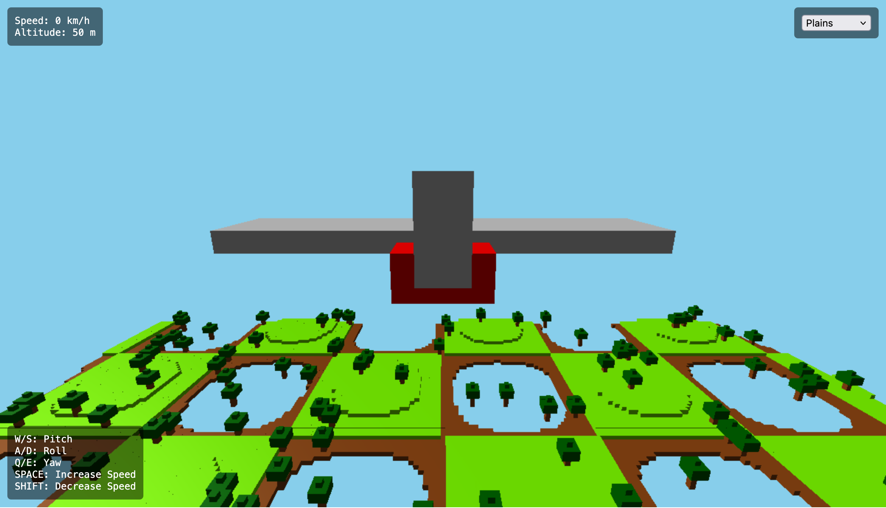

## BlockWings 🛩️
*A Minecraft-style flight simulator built with Three.js.*

### ✈️ Overview
BlockWings is a web-based flight simulator featuring voxel-style graphics inspired by Minecraft. Fly through different landscapes, experience realistic flight dynamics, and enjoy an immersive audio experience.

Demo: https://makalin.github.io/BlockWings/

### 🚀 Features
- **Voxel-based world:** Fly over plains, mountains, and islands.
- **Realistic flight mechanics:** Control pitch, roll, yaw, and speed.
- **Dynamic terrain generation:** Different environments with procedural landscapes.
- **Audio immersion:** Engine and wind sounds adapt based on speed.
- **HUD display:** Real-time speed and altitude indicators.

### 🎮 Controls
| Key  | Action       |
|------|-------------|
| W/S  | Pitch (up/down) |
| A/D  | Roll (left/right) |
| Q/E  | Yaw (left/right) |
| Space | Increase speed |
| Shift | Decrease speed |

### 🌍 Environments
Select from different levels:
- **Plains** - A smooth, hilly landscape with trees.
- **Mountains** - A rugged terrain with rocky peaks and snow caps.
- **Islands** - A tropical paradise with water and palm trees.

### 🛠️ Technologies Used
- **[Three.js](https://threejs.org/):** WebGL-powered 3D rendering.
- **JavaScript (ES6+):** Core scripting for game logic.
- **HTML & CSS:** UI elements and overlays.

### 📦 Installation & Running Locally
1. Clone the repository:
   ```bash
   git clone https://github.com/makalin/BlockWings.git
   ```
2. Navigate to the project folder:
   ```bash
   cd BlockWings
   ```
3. Open `index.html` in a browser.

### 📷 Screenshots


### 🚀 Future Enhancements
- Multiplayer mode
- More aircraft types
- Enhanced physics engine

### 📜 License
This project is licensed under the MIT License.
